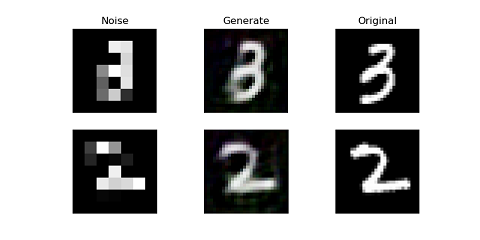

# 低解像度画像を高解像度画像にして識別精度を上げる

## 概要
  * Super-Resolution gan(SRGAN)で画像を高解像度にし、VGGで識別
  * サンプルデータとしてmnist, fashion_mnist, cifar10が使用できる
  * SRGAN学習用データ、VGG学習用データ、テストデータに分割し、
  学習用データはそのままの解像度画像と低解像度画像をそれぞれ作成する
  * 高解像度画像の識別、低解像度画像の識別、低解像度画像を高解像度画像にした画像の識別が選択できる
  (テストデータはすべての条件で同一)
  * param.ymlファイルでデータの選択やパラメータの設定ができる
  
## version
* python: 3.6.9
* tqdm: 4.46.1
* numpy: 1.18.5
* argparse: 1.4.0
* PyYAML: 5.3.1
* attrdict: 2.0.1
* matplotlib: 3.2.1
* opencv-python: 4.2.0.34
* tensorflow: 1.15.0
* keras: 2.3.1

## 実行方法
* ライブラリのインストール\
'pip install -r requirements.txt'

* SRGANの学習\
'python main.py -g'

* SRGANによる生成画像の確認\
'python main.py -c'

* VGGを加工なしのデータでfine tuning\
'python main.py -t -d original'

* VGGを低解像度データでfine tuning\
'python main.py -t -d noise'

* VGGをSRGANで高解像度にしたデータでfine tuning\
'python main.py -t -d generate'

* VGGによる識別\
'python main.py -p'

## 引数
* `-g, --gan`
  * SRGANの学習
* `-c, --check_gan`
  * GNAで生成した画像のチェック
* `-t, --train`
  * VGGの学習
* `-p, --prediction`
  * VGGによる識別
* `-d data_name, --data data_name`
  * 使用するデータの選択
  * data_name:
    * original: 画像の加工なしのデータ (default)
    * noise: 画像を低解像度にしたデータ
    * generate: 低解像度にした画像をSRGANで高解像度に変換したデータ
* `-param param_path, --param param_path`
  * パラメータの設定ファイル
  * param_path:
    * `./param/param.yml` (default)
    
## 結果
### 入力画像
mnistの例

### 認識率
mnistの例

| noise |generate| original |
| :---: | :---: | :---: |
| 93.03 % | 95.19 % | 98.67 % |

## 参考文献
[1] C. Ledig, L. Theis, F. Huszar, J. Caballero, A. Cunningham, 
A. Acosta, A. Aitken, A. Tejani, J. Totz, Z. Wang, et al. 
"Photo-realistic single image super-resolution using a generative adversarial network". 
arXiv preprint arXiv:1609.04802, 2016.
